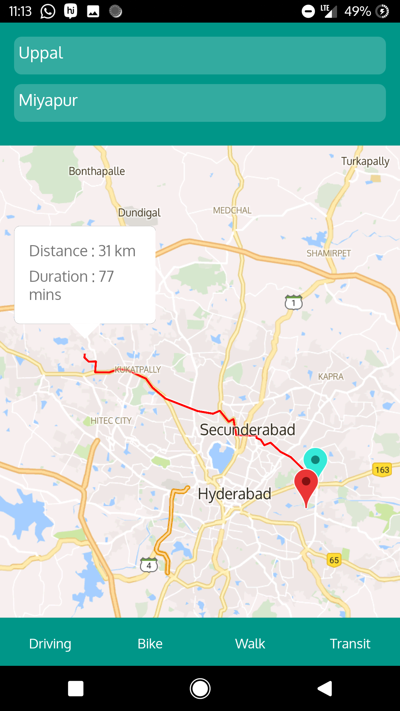

# hasura-map-app

This is a stand alone Reactnative map application using Python backend harnessing the power of Google Directions API

# Setting Up

Make sure you have react-native environment set up on your development system.

Follow the documentation: https://facebook.github.io/react-native/docs/getting-started.html .
Choose "Building Project with Native Code" and follow the instructions to set dependencies and setting up the environment.
You need not create a new application.

Once you have set up the environment, clone this repository into the folder in which the environment has been setup.

> git clone https://github.com/alpha2303/hasura-map-app.git

Go one folder inside, open a terminal and run the following command:

> npm install

> react-native link

This will ensure that all dependencies including node modules have been installed and linked to the application for usage.

Now all that is left is to run the following command in the above terminal: 

> cd android && ./gradlew assembleRelease

The generated APK can be found under android/app/build/outputs/apk/app-release.apk, and is ready to be distributed.

To run the app on your device, install it manually, or just enter the following command in above terminal : 

> react-native run-android --variant=release

If you're running it for iOS then type:

> react-native run-ios --variant=release

# How to Use

This app basically works on Google's Direction API with restriction for Android apps in place.
Enter your Source and Destination Locations and the app automatically highlights the best possible routes, along with the distance covered as well and the travel duration.

# Issues

For now only the "Driving" mode of transit is working, further modes will be added as the extensions are made in future. Sorry for the inconvenience.

Please let me know if any complications arise. Thank you.

# UI

